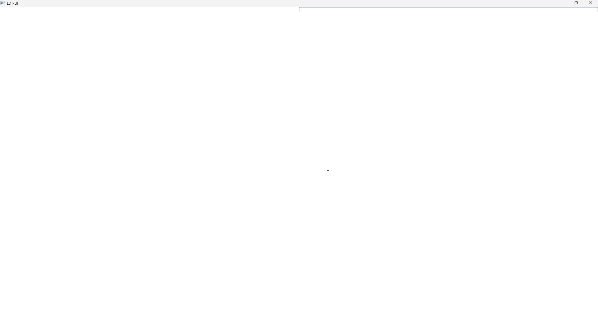

[**中文**](README_ZH.md) | **English**

# LDT — Lightweight Declarative Toolkit

[](https://github.com/timey777/ldt-ui/actions/workflows/build.yml)
[](https://github.com/timey777/ldt-ui/actions/workflows/android.yml)


> 🚧 **Early Stage** — This project is in active early development. APIs and DSL syntax may change.

**LDT** is a **lightweight C++ native UI runtime** driven by a declarative DSL, designed for building small, cross-platform applications. Its concise DSL is also well-suited for AI-assisted UI generation.



---

## Design Philosophy

- **Lightweight First**: Small core binary, minimal dependencies, no heavy runtime
- **Declarative DSL**: Describe UI structure and styling via CSS-like `.ldt` files — concise, intuitive, and AI-friendly
- **Native Rendering**: OpenGL-based custom rendering ensures consistent cross-platform appearance without relying on system widgets
- **Cross-Platform**: One codebase for Windows, Linux desktop, and Android mobile

## Use Cases

- Desktop tools requiring **small footprint and high performance** native UI
- Projects where **AI generates the UI** directly (DSL syntax is LLM-friendly)
- Unified cross-platform desktop + mobile UI solutions

---

## Quick Start

### Linux

Install dependencies:

```bash
sudo apt update
sudo apt install -y \
  cmake \
  ninja-build \
  build-essential \
  libx11-dev \
  libxrandr-dev \
  libxinerama-dev \
  libxcursor-dev \
  libxi-dev \
  libfreetype-dev
```

Build:

```bash
git clone https://github.com/timey777/ldt-ui.git
cd ldt-ui

cmake -B build -DCMAKE_BUILD_TYPE=Release
cmake --build build
```

Run:

```bash
./build/bin/examples
```

### Windows

```powershell
cmake -B build
cmake --build build --config Release
```

### Android

See [Android Build Guide](android_example/BUILD_ANDROID.md).

Example source code is in the [`examples/`](examples/) directory.

---

## Documentation

| Document | Description |
|----------|-------------|
| [LDT DSL User Guide (中文)](docs/LDT_DSL_USER_GUIDE.md) | Complete DSL tutorial in Chinese |
| [LDT DSL User Guide (English)](docs/LDT_DSL_USER_GUIDE_EN.md) | Complete DSL tutorial in English |
| [LDT DSL Reference for AI (中文)](docs/LDT_DSL_AI_REFERENCE.md) | Compact reference for AI context (Chinese) |
| [LDT DSL Reference for AI (English)](docs/LDT_DSL_AI_REFERENCE_EN.md) | Compact reference for AI context (English) |

---

## Project Structure

```
ldt-ui/
├── src/                  # Core library source
│   ├── components/       # Built-in widgets (panel, text, button, input…)
│   ├── engine/           # Rendering engine & window management
│   ├── layout/           # Layout engine (block / flex / grid / inline)
│   ├── render/           # OpenGL rendering layer
│   └── debugger/         # Debugging utilities
├── examples/             # Example applications
├── docs/                 # Documentation
├── thirdparty/           # Third-party dependencies (glfw, glad, freetype)
├── ldt-tests/            # Test cases and test framework
├── android_example/      # Android project example
└── resources/            # Fonts and other resource files
```

---

## Platform Support

| Platform | Status |
|----------|--------|
| Windows (x64) | ✅ |
| Linux (x64) | ✅ |
| Android | ✅ |
| macOS | Planned |
| iOS | Planned |

---

## Roadmap

- 🧪 **Unit Test Suite** — Comprehensive automated tests for core components, layout engine, and DSL parser
- 📦 **DSL Versioning** — Support multiple DSL syntax versions with forward compatibility for smooth evolution
- 🖥️ **macOS / iOS Support** — Expand platform coverage
- 🔧 **Embedded / IoT Adaptation** — Provide a stripped-down build for resource-constrained devices

---

## Dependencies

- **GLFW** — Cross-platform window & input
- **OpenGL 3.3+** — Rendering backend
- **FreeType** — Font rasterization
- **CMake 3.10+** — Build system

---

## License

This project is licensed under the [Apache License 2.0](LICENSE).

---

## Feature Guide

This section covers two capabilities built directly on top of the engine's native APIs:

### 1. Dynamic UI Components — Build reusable runtime-composed UI modules

`UIComponent` (`src/components/ui_component.h`) lets you encapsulate LDT UI logic into **dynamically mountable / unmountable modules**. Each module owns its DSL, event bindings, and lifecycle, and can be embedded like a "plugin" under any node of any Scene.

```cpp
namespace ldt {

class UIComponent {
public:
    virtual ~UIComponent() = default;
    virtual void onAttach(Scene* scene, const std::string& parentId) = 0;
    virtual void onDetach(Scene* scene) {}
};

}
```

#### Usage Example

A "New Session" popup panel that encapsulates DSL parsing, mounting, and event binding:

```cpp
#include "components/ui_component.h"
#include "engine/core/parse.h"
#include "engine/core/resolved_builder.h"
#include "components/resolved_mount_service.h"

class NewSessionPopComponent : public UIComponent {
public:
    void onAttach(Scene* scene, const std::string& parentId) override {
        // Avoid duplicates — just show if already mounted
        auto existing = scene->getControlManager()->findControlById("session-pop");
        if (existing) { existing->setVisible(true); return; }

        // Parse DSL snippet
        LDTParser parser;
        auto snippet = parser.parse(R"ui(
panel:session-pop(class="v-box pop") {
    button:btnCancelComp(){text(value="Cancel")}
}
)ui");

        // Build and mount resolved subtree
        auto resolved = ResolvedBuilder::BuildResolvedSubtreeFromSnippet(
            snippet, scene->getDocumentRuntime());
        ResolvedMountService::MountResolvedSubtreeUnderId(
            scene->getResolvedTreeView(), parentId, resolved,
            scene->getDocumentRuntime());

        // Bind click event
        scene->onClick("#btnCancelComp", [scene](const auto&) {
            auto pop = scene->getControlManager()->findControlById("session-pop");
            if (pop) pop->setVisible(false);
        });
    }
};
```

Triggering from a Scene:

```cpp
onClick("#session-add", [this](const auto&) {
    auto popComp = std::make_shared<NewSessionPopComponent>();
    popComp->onAttach(this, "view");
});
```

| Concept | Description |
|---------|-------------|
| **Mount on demand** | `onAttach()` parses → builds → mounts in one call; destroy or hide when done |
| **Self-contained** | DSL template, events, and sub-components are fully encapsulated inside the class |
| **Flexible placement** | `parentId` parameter targets any existing panel in the scene |
| **Lifecycle** | `onDetach()` can reverse the mount (no-op by default) |

---

### 2. Multi-View Rendering — Embed and preview LDT content in multiple independent views

`PreviewViewCoordinator` (`src/engine/preview_view_coordinator.h`) lets you embed **multiple independent** LDT rendering views inside a single Scene. Each view has its own `DocumentRuntime`, `StyleEngine`, `LayoutEngine`, `ASTBuildEngine`, and `Compositor`, so they can load and refresh different LDT content independently without interference.

```cpp
class PreviewViewCoordinator : public ViewCoordinator {
public:
    explicit PreviewViewCoordinator(
        Compositor* compositor,
        DocumentRuntime* context,
        ViewportSizeDp initialViewportSize,
        std::atomic<bool>* pendingPresent = nullptr,
        SceneResolver sceneResolver = SceneResolver(),
        std::string previewSlotId = "preview");

    // Inherited from ViewCoordinator:
    void bind(Scene* scene);                     // Attach to a host Scene
    void apply(DocumentUpdatePlan plan);          // Trigger a preview refresh
};
```

#### Usage Example

**1.** Define placeholder panels in the host Scene's DSL:

```ldt
panel:root(){
  panel:slotA() {}   /* Preview A slot */
  panel:slotB() {}   /* Preview B slot */
}
```

**2.** Create and bind `PreviewViewCoordinator` instances (store them as **member variables** to prevent premature destruction):

```cpp
#include "engine/preview_view_coordinator.h"
#include "engine/core/parse.h"
#include "engine/style_engine.h"
#include "engine/layout_engine.h"
#include "engine/astbuild_engine.h"
#include "engine/box_model_engine.h"

class MyScene : public Scene {
    // NOTE: These must be member variables — never local variables!
    std::unique_ptr<DocumentRuntime> runtimeA_;
    std::unique_ptr<Compositor> compositorA_;
    std::unique_ptr<PreviewViewCoordinator> previewA_;

    void setupPreviews() {
        // --- Preview A ---
        auto styleA   = std::make_unique<StyleEngine>();
        auto layoutA  = std::make_unique<LayoutEngine>();
        auto astBuildA = std::make_unique<ASTBuildEngine>();

        runtimeA_ = std::make_unique<DocumentRuntime>();
        runtimeA_->registerService(styleA.get());
        runtimeA_->registerService(layoutA.get());
        runtimeA_->registerService(astBuildA.get());
        runtimeA_->setTextMeasurer(getDocumentRuntime()->getTextMeasurer());
        runtimeA_->initializeAll({ typeid(StyleEngine), typeid(LayoutEngine),
                                   typeid(ASTBuildEngine), typeid(BoxModelEngine) });

        compositorA_ = std::make_unique<Compositor>();
        previewA_ = std::make_unique<PreviewViewCoordinator>(
            compositorA_.get(), runtimeA_.get(),
            ViewportSizeDp{{300},{150}},
            nullptr,
            ViewCoordinator::SceneResolver{},
            "slotA");
        previewA_->bind(this);

        // Load LDT content
        LDTParser p;
        auto astA = p.parse("button(){text(value=\"Click Me\")}").root();
        runtimeA_->notifyASTUpdated(astA);
        previewA_->apply(DocumentUpdatePlan{DocumentUpdateKind::ASTRepaint});
    }
};
```

| Concept | Description |
|---------|-------------|
| **Independent engines** | Each preview has its own `DocumentRuntime` + engines + `Compositor` |
| **Slot ID binding** | 6th constructor parameter selects the target `panel:xxx()` in the host DSL |
| **Independent refresh** | Each preview calls `apply(ASTRepaint)` individually — no cross-talk |
| **Shared TextMeasurer** | Use `hostRuntime->getTextMeasurer()` to avoid re-creating the measurer |
| **Zero intrusion** | Host Scene only needs placeholder panels; no extra inheritance or registration |

---

## Disclaimer

This is an early-stage project. Features and APIs are subject to change and it is not yet recommended for production use. Feedback, testing, and contributions are welcome!
